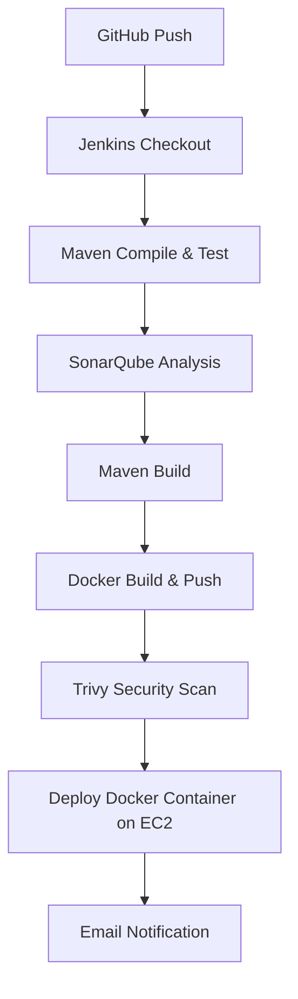
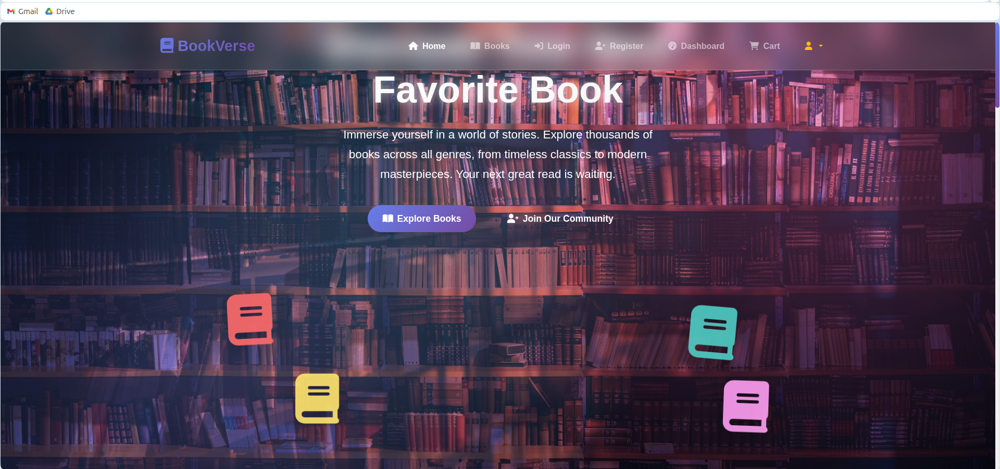
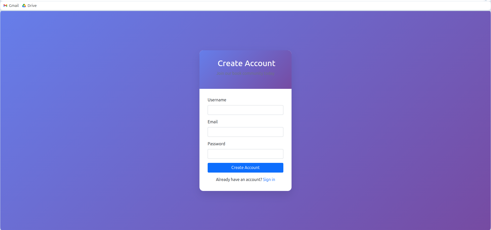
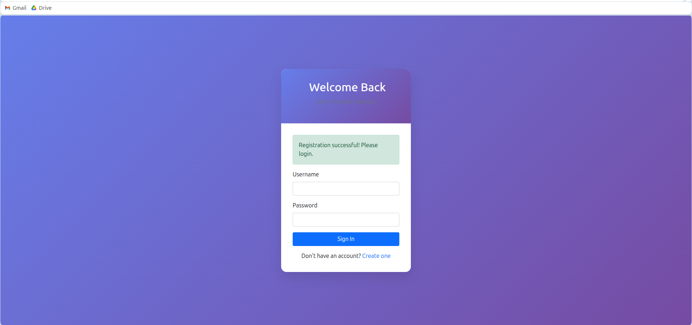
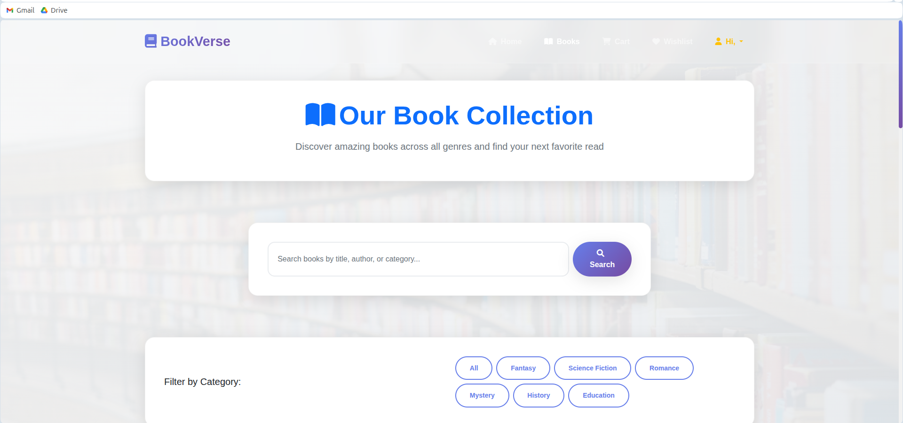
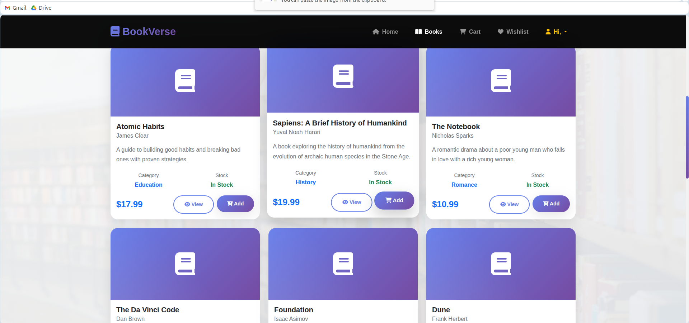
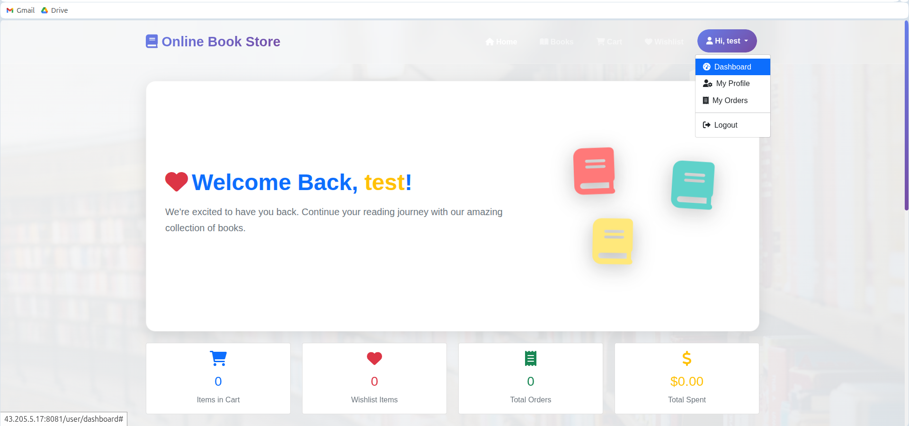

# 🛒 Online Book Store

**Online Book Store** is a full-stack Spring Boot application deployed using **Docker** and automated with **Jenkins CI/CD**.
It features a MySQL database, modern REST APIs, and a smooth deployment workflow with code quality checks via **SonarQube**.

---

## 🚀 Features

* Spring Boot backend with REST APIs
* MySQL database integration
* Dockerized application for easy deployment
* Jenkins CI/CD pipeline with automated build, test, SonarQube analysis, Docker build & push, Trivy scan, and deployment
* Email notifications on build success/failure
* Containerized deployment on AWS EC2
* Maven build automation

---

## 📦 Tech Stack

| Layer               | Technology/Tool          |
| ------------------- | ------------------------ |
| Backend             | Spring Boot 3, Java 17   |
| Database            | MySQL 8.0                |
| CI/CD               | Jenkins, GitHub Webhooks |
| Code Quality        | SonarQube, Trivy         |
| Containerization    | Docker                   |
| Deployment Platform | AWS EC2                  |

---

## 🔧 Prerequisites

* AWS EC2 instance with Docker & Jenkins installed
* MySQL database accessible from EC2
* GitHub repository with project code
* Jenkins credentials for Docker Hub and SMTP (email)

---

## ⚙️ Jenkins Pipeline

The Jenkins pipeline automates the full lifecycle of the application:

1. **Checkout** – Pulls the latest code from GitHub.
2. **Maven Compile & Test** – Builds the project and runs unit tests.
3. **SonarQube Analysis** – Performs static code analysis for quality metrics.
4. **Maven Build** – Packages the application as a JAR file.
5. **Docker Build & Push** – Builds the Docker image and pushes it to Docker Hub.
6. **Trivy Scan** – Security vulnerability scan for Docker images.
7. **Deploy Container** – Stops old container and runs a new one on EC2.
8. **Email Notifications** – Sends success/failure alerts via SMTP.

---

## 📝 Pipeline Flow Diagram



---

## ⚡ Steps to Run Locally

1. **Clone Repository**

```bash
git clone https://github.com/Saifudheenpv/Online-Book-Store.git
cd Online-Book-Store
```

2. **Configure `application.properties`**

```properties
spring.datasource.url=jdbc:mysql://<EC2-private-ip>:3306/bookstore
spring.datasource.username=bookuser
spring.datasource.password=bookpass
```

3. **Build with Maven**

```bash
mvn clean package -DskipTests
```

4. **Run Docker Container**

```bash
docker build -t saifudheenpv/online-book-store:latest .
docker run -d --name onlinebookstore -p 8081:8080 saifudheenpv/online-book-store:latest
```

5. **Access Application**

```
http://<EC2-public-ip>:8081
```
## Website Screenshots

### Home Page


### Register User


### Login User


### Profile Page


### Browse Books


### User Dashboard


---

## 📫 Email Notifications

* **Success**: Build completed and deployment succeeded
* **Failure**: Build failed or deployment error
* Configured via Gmail SMTP in Jenkins

---

## 📌 Notes

* Ensure EC2 security groups allow **port 8081** for web access and **3306** for MySQL.
* Jenkins credentials must be configured for Docker Hub and Gmail SMTP.
* Pipeline handles old container cleanup automatically.

---

✅ **Your Online Book Store is now fully automated, monitored, and deployable via Jenkins CI/CD!**
